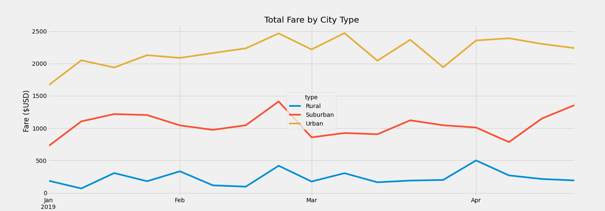
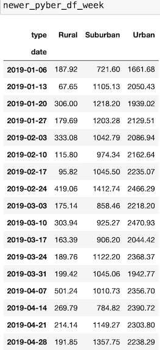
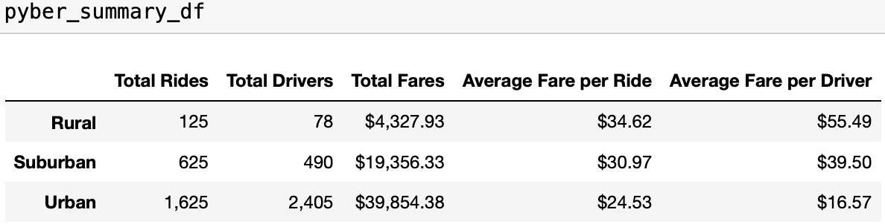

# PyBer_Analysis

## Overview

The purpose of this analysis is to analyze the ride-sharing data based on the city types (Urban, Suburban, and Rural) to come up with recommendations for the PyBer CEO. In this analysis we create two data frames, a summary data frame called `pyber_summary_df` and a pivot data frame called `newer_pyber_df_week` that looks at the total sum of fares on a weekly basis, and a stacked line graph that graphs the `newer_pyber_df_week` results by city type. In this analysis we are using Python 3.9.7, Jupyter Notebook 6.4.5, and Conda 4.10.3.

## Results
Using images from the summary DataFrame and multiple-line chart, describe the differences in ride-sharing data among the different city types.

Looking at the line graphs for all city types, they all peaked on the third week of February, which happens to be week of Valentine's Day. For the Urban line graph, it also peaked on the first week of March, which is the week of Mardi Gras. The third peak for the Urban line graph was on the third week of March, which is the week of St. Patrick's Day. The final peak of the Urban line graph was on the second week of April, which is the week that leads up to Easter. Visually, the last peak doesn't look more flat than it does a peak. The reason behind it is because Easter is a weekend holiday, which means friends and family members travel a couple of days before Easter, and leave a couple of days after Easter.

Understanding why the line graphs are stacked is also important. Demand for transportation is very high in Urban cities, as well as the number of substitutes in transportation (walking, biking/scooter, buses, subways, ride-sharing). That is why the Urban line graph is at the very top. Demand for transportation in Suburban cities is not as high compared to Urban cities, but it is still important. People who live in suburban cities tend to own a vehicle and use that as their main way of transportation, and also the number of substitutes in transportation is less (people are less likely to walk, and subways don't usually make it to the suburbs, but buses and biking is still a viable source of transportation). That is why the Suburban line graph is in the middle. People who live in rural cities tend to own a vehicle and use that as their only source of transportation. Public transportation is very limited in these cities. That is why the Rural line graph is at the bottom.

Looking at the `pyber_summary_df`data frame, we notice that Rural and Suburban cities have more rides than drivers, meaning there is a high demand for rides and not enough drivers to meet that demand, leading to longer wait times and higher fare prices. For Urban cities, there are more drivers than there are rides, which means that demand for rides is low and there are too many drivers waiting for a ride, leading to lower fares and higher labor costs. 

## Summary
Based on the results, provide three business recommendations to the CEO for addressing any disparities among the city types. 

My three business recommendations for the CEO are:

- Have promotions and increase marketing during these holidays to increase demand for rides.

- Advertise ride-sharing as the best option for transportation in urban cities, as well as capitalizing on the substitutes for transportation. The more market power on transportation, the better. For suburban and rural cities, hire more drivers in these cities to make rides more accessible.

- Incentivize Urban city drivers to take more rides in Suburban or Rural cities. This will increase the supply of drivers in Suburban and Rural cities, and decrease the supply of drivers in Urban cities. Reaching equilibrium with drivers and rides will lead to more efficient spending, while decreasing wait time and increasing customer satisfaction.